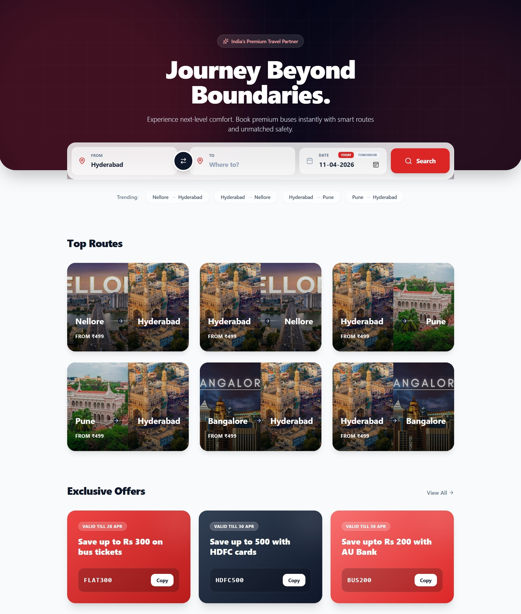
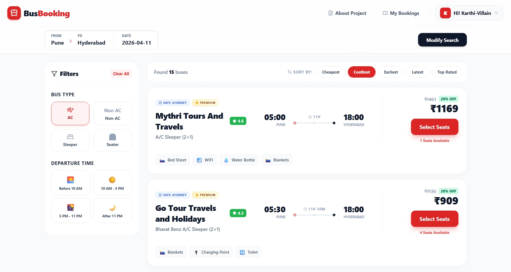
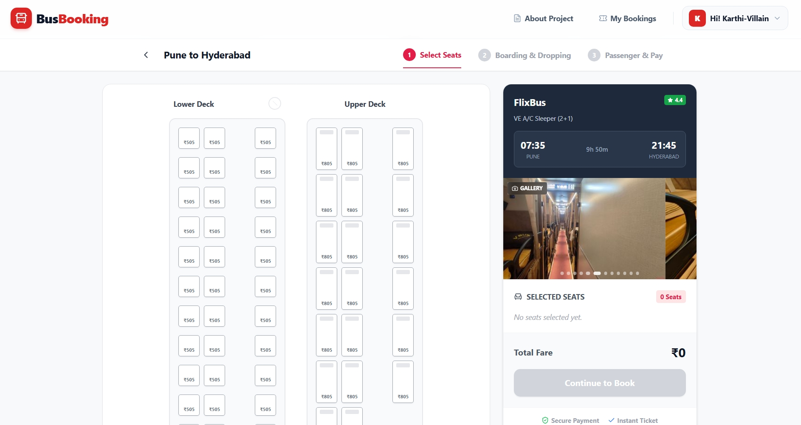
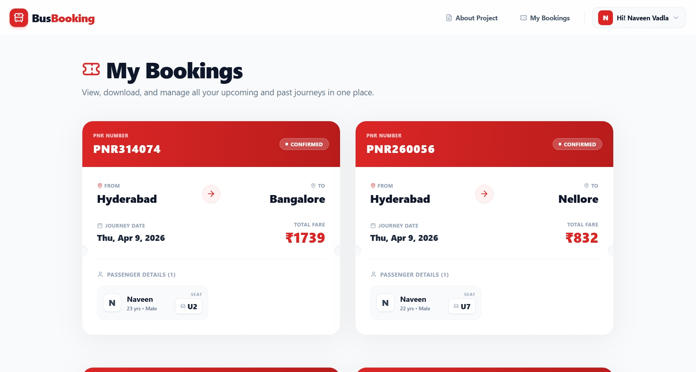

<div align="center">

# 🚌 BusBooking — Online Bus Reservation System

[](https://reactjs.org/)
[](https://flask.palletsprojects.com/)
[](https://www.mysql.com/)
[](https://razorpay.com/)
[](https://ollama.com/)
[](https://www.trychroma.com/)
[](LICENSE)

**A full-stack bus ticket reservation platform with real-time seat selection, gender-based seating rules, integrated payment processing, and an AI-powered chatbot assistant.**

[Features](#-features) · [Architecture](#-architecture) · [Tech Stack](#-tech-stack) · [Chatbot](#-ai-chatbot) · [Screenshots](#-screenshots) · [Getting Started](#-getting-started) · [API Reference](#-api-reference)

---

</div>

## 📸 Screenshots

<div align="center">
<table>
<tr>
<td></td>
<td></td>
</tr>
<tr>
<td align="center"><b>🏠 Home — Route Search</b></td>
<td align="center"><b>🚌 Bus Selection</b></td>
</tr>
<tr>
<td></td>
<td></td>
</tr>
<tr>
<td align="center"><b>💺 Interactive Seat Selection</b></td>
<td align="center"><b>📋 View / Download Bookings</b></td>
</tr>
</table>
</div>

---

## ✨ Features

| Category | Feature |
|----------|---------|
| 🔐 **Auth** | JWT-based signup/login with role-based access (admin, user) |
| 🗺️ **Routes** | Multi-stop route search with origin ↔ destination filtering |
| 💺 **Seats** | Real-time seat map with gender-based adjacency rules |
| 💳 **Payments** | Razorpay integration with order verification & refund support |
| 📧 **Notifications** | Async email confirmations via Flask-Mail |
| 🤖 **AI Chatbot** | RAG-powered assistant using LLaMA 3 + ChromaDB for instant bus info |
| 📱 **Responsive** | Mobile-first UI with Tailwind CSS & Framer Motion animations |
| 🛡️ **Security** | Password hashing (Werkzeug), CORS policies, input validation |

---

## 🏗️ Architecture

```
┌──────────────────────────────────────────────────────────┐
│                       CLIENT                             │
│    React 18 + Vite + Tailwind CSS + Framer Motion        │
│  ┌──────┐ ┌──────┐ ┌───────┐ ┌────────┐ ┌──────────┐    │
│  │ Home │ │Seats │ │Payment│ │Bookings│ │ Chatbot  │    │
│  └──┬───┘ └──┬───┘ └──┬────┘ └───┬────┘ └────┬─────┘    │
│     └────────┴────────┴──────────┴────────────┘          │
│                        │  Axios HTTP                     │
├────────────────────────┼─────────────────────────────────┤
│                        ▼                                 │
│  ┌─────────────────────────────────────────────────┐     │
│  │              FLASK REST API (:5000)              │     │
│  │  JWT Auth Middleware                             │     │
│  │  /api/auth  /api/routes  /api/buses              │     │
│  │  /api/bookings  /api/payment                     │     │
│  └──────────────┬──────────────────────────────────┘     │
│                 │  SQLAlchemy ORM                        │
│                 ▼                                        │
│  ┌──────────────────┐  ┌──────────────────┐              │
│  │   MySQL 8.0      │  │   Razorpay API   │              │
│  │   7 Tables       │  │   Payment GW     │              │
│  └──────────────────┘  └──────────────────┘              │
│                                                          │
│  ┌─────────────────────────────────────────────────┐     │
│  │           CHATBOT SERVICE (:5001)                │     │
│  │  Flask + Ollama (LLaMA 3) + ChromaDB             │     │
│  │  /chat  /bot                                     │     │
│  │  RAG Pipeline → Vector Search → LLM Response     │     │
│  └──────────────┬──────────────┬───────────────────┘     │
│                 ▼              ▼                          │
│  ┌──────────────────┐  ┌──────────────────┐              │
│  │  ChromaDB        │  │  Ollama          │              │
│  │  Vector Store    │  │  LLaMA 3 (local) │              │
│  └──────────────────┘  └──────────────────┘              │
└──────────────────────────────────────────────────────────┘
```

---

## 🛠️ Tech Stack

### Frontend
| Technology | Purpose |
|-----------|---------|
| React 18 | Component-based UI |
| Vite | Build tool & dev server |
| Tailwind CSS | Utility-first styling |
| Framer Motion | Animations & transitions |
| React Router v6 | Client-side routing |
| Axios | HTTP client |

### Backend
| Technology | Purpose |
|-----------|---------|
| Flask 3.x | REST API framework |
| SQLAlchemy | ORM & database abstraction |
| Flask-JWT-Extended | Token-based authentication |
| Flask-Mail | Email notifications |
| Razorpay SDK | Payment processing |
| Werkzeug | Password hashing |

### AI Chatbot
| Technology | Purpose |
|-----------|---------|
| Ollama + LLaMA 3 | Local LLM for natural language understanding |
| ChromaDB | Vector database for semantic search |
| Flask | Chatbot API server |
| RAG Pipeline | Retrieval-Augmented Generation for accurate responses |

### Database
| Technology | Purpose |
|-----------|---------|
| MySQL 8.0 | Relational data store (7 tables) |
| ChromaDB | Vector embeddings store for chatbot |

---

## 🤖 AI Chatbot

The platform includes an **AI-powered chatbot assistant** that helps users find bus routes, check prices, view boarding/dropping points, and get answers to FAQs — all through natural conversation.

### How It Works

```
User Query → Query Type Detection → Vector Search (ChromaDB)
    → Context Retrieval → LLM Prompt (LLaMA 3) → Structured JSON Response
```

1. **Intent Detection** — Classifies queries into: `route`, `bus_info`, `stops`, or `faq`
2. **Vector Search** — Retrieves relevant bus data from ChromaDB using semantic embeddings
3. **Keyword Fallback** — If vector similarity is poor (distance > 1.5), falls back to keyword matching
4. **LLM Response** — LLaMA 3 generates a structured JSON response using only the retrieved context
5. **Caching** — MD5-based query caching for instant repeat responses

### Chatbot Capabilities

| Query Type | Example | Response |
|-----------|---------|----------|
| 🗺️ Route Search | *"Buses from Hyderabad to Bangalore"* | List of available buses with prices |
| 🚌 Bus Info | *"What is the price of VRL Travels?"* | Bus details, type, departure, price |
| 📍 Stops | *"Boarding points for Hyderabad to Bangalore"* | Boarding & dropping point lists |
| ❓ FAQ | *"What is the luggage policy?"* | Direct answer from knowledge base |

### Response Format

The chatbot always returns structured JSON:

```json
{
  "message": "Here are the available buses from Hyderabad to Bangalore",
  "info": [
    {
      "name": "VRL Travels",
      "type": "Sleeper",
      "departure": "22:00",
      "price": 1200,
      "busid": 1,
      "from": "Hyderabad",
      "to": "Bangalore"
    }
  ],
  "q_type": "busses"
}
```

> 📖 For detailed chatbot documentation, see [`chatbot/README.md`](BusBot/README.md)

---

## 🚀 Getting Started

### Prerequisites

- **Node.js** ≥ 18.x & **npm** ≥ 9.x
- **Python** ≥ 3.10
- **MySQL** ≥ 8.0
- **Ollama** (for AI chatbot)

### Quick Start

```bash
# 1. Clone the repository
git clone https://github.com/Karthi-Villain/BusBookingSystem.git
cd BusBookingSystem

# 2. Backend setup
cd backend
python -m venv venv
source venv/bin/activate        # Windows: venv\Scripts\activate
pip install -r requirements.txt
cp .env.example .env            # Configure DB & API keys
flask run --port 5000

# 3. Frontend setup (new terminal)
cd frontend/bus-booking-ui
npm install
npm run dev                     # Opens at http://localhost:5173

# 4. Chatbot setup (new terminal)
cd chatbot
pip install flask flask-cors chromadb ollama
ollama pull llama3              # Download LLaMA 3 model
python train.py                 # Build vector database from bus data
python app.py                   # Starts chatbot on http://localhost:5001
```

---

## 📡 API Reference

### Core APIs (Port 5000)

| Method | Endpoint | Auth | Description |
|--------|----------|------|-------------|
| `POST` | `/api/auth/register` | ✗ | User registration |
| `POST` | `/api/auth/login` | ✗ | User login → JWT token |
| `GET` | `/api/routes/search` | ✗ | Search routes by origin/dest/date |
| `GET` | `/api/buses/<id>/seats` | ✓ | Fetch seat map for a bus |
| `POST` | `/api/bookings` | ✓ | Create booking with passenger details |
| `POST` | `/api/payment/create-order` | ✓ | Initiate Razorpay payment order |
| `POST` | `/api/payment/verify` | ✓ | Verify payment signature |
| `GET` | `/api/bookings/my` | ✓ | Fetch user's booking history |

### Chatbot API (Port 5001)

| Method | Endpoint | Description |
|--------|----------|-------------|
| `GET` | `/bot` | Chat UI interface |
| `POST` | `/chat` | Send query, get structured JSON response |

#### Chat Request

```bash
curl -X POST http://localhost:5001/chat \
  -H "Content-Type: application/json" \
  -d '{"query": "Buses from Hyderabad to Bangalore"}'
```

---

## 📂 Project Structure

```
busbooking/
├── backend/
│   ├── models.py              # SQLAlchemy models (7 tables)
│   ├── routes.py              # Flask API endpoints
│   ├── config.py              # App configuration
│   ├── requirements.txt       # Python dependencies
│   └── .env.example           # Environment template
├── frontend/
│   ├── src/
│   │   ├── pages/             # Home, Seats, Payment, MyBookings, Auth
│   │   ├── components/        # Reusable UI components
│   │   └── App.jsx            # Root component & routing
│   ├── package.json
│   └── vite.config.js
├── BusBot/
│   ├── app.py                 # Chatbot Flask server
│   ├── train.py               # Vector DB builder
│   ├── data/data.json         # Bus routes & FAQ data
│   ├── templates/chat.html    # Chat UI template
│   ├── db/                    # ChromaDB persistent storage
│   └── README.md              # Chatbot documentation
└── README.md                  # ← You are here
```

---

## 🗄️ Database Schema

```sql
users          → id, name, email, password_hash, gender, role
routes         → id, origin, destination, distance_km
route_stops    → id, route_id, stop_name, stop_order, km_from_origin
buses          → id, route_id, name, bus_type, departure_time, price_per_km
seats          → id, bus_id, seat_number, seat_type, deck, is_booked, gender
bookings       → id, user_id, bus_id, total_amount, status, razorpay_order_id
passengers     → id, booking_id, seat_id, name, age, gender
```

---

## 🤝 Contributing

1. Fork the repository
2. Create your feature branch (`git checkout -b feature/amazing-feature`)
3. Commit changes (`git commit -m 'feat: add amazing feature'`)
4. Push to branch (`git push origin feature/amazing-feature`)
5. Open a Pull Request

---

<div align="center">

**Built with ❤️ using React, Flask & LLaMA 3**

⭐ Star this repo if you found it helpful!

</div>
